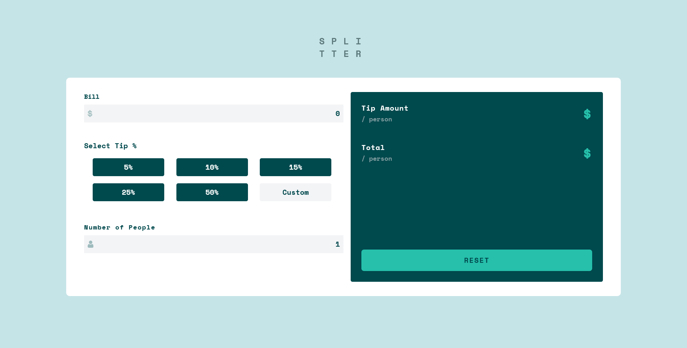

# Frontend Mentor - Tip calculator app solution

This is a solution to the [Tip calculator app challenge on Frontend Mentor](https://www.frontendmentor.io/challenges/tip-calculator-app-ugJNGbJUX). Frontend Mentor challenges help you improve your coding skills by building realistic projects.

## Table of contents

- [Overview](#overview)
  - [The challenge](#the-challenge)
  - [Screenshot](#screenshot)
  - [Links](#links)
- [My process](#my-process)
  - [Built with](#built-with)
  - [What I learned](#what-i-learned)
  - [Continued development](#continued-development)
- [Author](#author)

**Note: Delete this note and update the table of contents based on what sections you keep.**

## Overview

### The challenge

Users should be able to:

- View the optimal layout for the app depending on their device's screen size
- See hover states for all interactive elements on the page
- Calculate the correct tip and total cost of the bill per person

### Screenshot

### Links

- Solution URL: [Add solution URL here](https://github.com/Haybuka/tip-calculator)
- Live Site URL: [Add live site URL here](https://tipcals.netlify.app)

## My process

### Built with

- Semantic HTML5 markup
- CSS custom properties
- Flexbox
- Mobile-first workflow
- Tailwind Css
- [React](https://reactjs.org/) - JS library

### What I learned

 During the course of this project, i got more reinforcement on the use of tailwindCss in projects and some quick hacks. Important to note is also passing functions about, and the use of memo to limit renders based on user calculations.

### Continued development

For continued development, i think i'd want to pay more attention to react Context and React use Reducers also. Understanding tailwind better also fits in this plan, but one at a time.

## Author

- Website - [Add your name here](https://github.com/Haybuka/tip-calculator)
- Frontend Mentor - [@yourusername](https://www.frontendmentor.io/profile/Haybuka)
- Twitter - [@yourusername](https://twitter.com/haybukarh)
